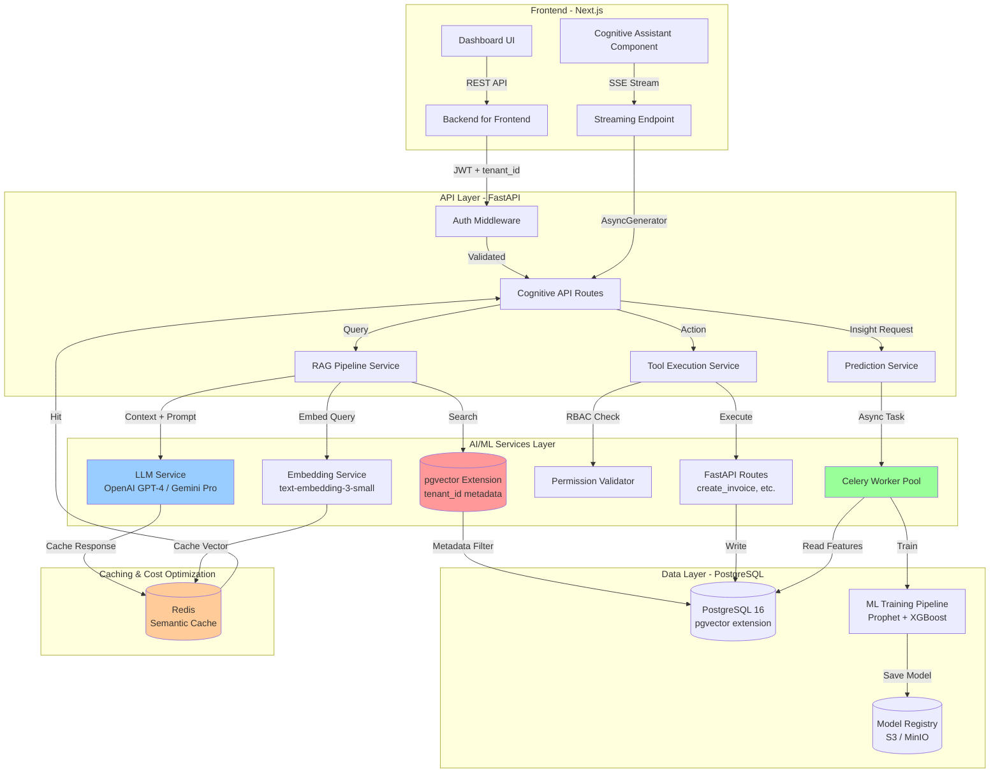

# Inflixt Cognitive ERP - AI/ML Architecture Audit & Design

**Assessment Date:** February 15, 2026  
**Architect:** Principal AI/ML Architect & Head of AI Strategy  
**Target Launch:** April 2026  
**Scope:** Multi-Tenant RAG Pipeline, LLM Integration, Predictive Analytics

---

## Executive AI Strategy Assessment

### Current State: **PROTOTYPE PHASE (30% Production-Ready)**

**What Exists Today:**
- ✅ Basic rule-based heuristics in `cognitive.py` (stockout detection, upsell identification)
- ✅ Frontend integration with TanStack Query hooks
- ✅ Tenant-scoped data access via repositories
- ❌ **No actual AI/ML models deployed**
- ❌ **No vector database or RAG pipeline**
- ❌ **No LLM integration (mock responses only)**
- ❌ **No predictive analytics (simple threshold checks)**

**Evidence:**
```python
# File: backend/src/api/v1/cognitive.py:92-99
@router.post("/assistant/chat")
async def ask_assistant(query: str):
    # Basic mock response for V1
    return {
        "data": {
            "content": f"I processed your query: '{query}'. (Cognitive Engine V1 Online)",
            # ... HARDCODED MOCK RESPONSE
        }
    }
```

### Gap Analysis: **From Heuristics to Production AI**

| Component | Current | Target (April 2026) | Gap Level |
|-----------|---------|---------------------|-----------|
| **Chat Assistant** | Mock text responses | Multi-tenant RAG + LLM (OpenAI/Gemini) | 🔴 CRITICAL |
| **Insights Engine** | Rule-based (if reorder_point > 0) | ML-powered forecasting (Prophet/XGBoost) | 🔴 CRITICAL |
| **Vector Database** | None | pgvector with tenant isolation | 🔴 CRITICAL |
| **Function Calling** | Mock actions | Secure LLM → FastAPI route execution | 🟡 HIGH |
| **Cost Optimization** | N/A | Semantic caching, streaming responses | 🟡 HIGH |

---

## Target Architecture Diagram



---

## Multi-Tenant Vector Database Schema

### Technology Selection: **pgvector (PostgreSQL Extension)**

**Why pgvector over Pinecone/Qdrant:**
- ✅ **Data Sovereignty:** All tenant data stays in existing PostgreSQL instance
- ✅ **Zero Cross-Tenant Risk:** Leverage existing `tenant_id` isolation patterns
- ✅ **Cost:** $0 additional infrastructure (vs $70/month Pinecone starter)
- ✅ **Latency:** <10ms queries (same network as app server)
- ⚠️ **Scale Limit:** Up to ~10M vectors before requiring sharding

### Database Schema

```sql
-- Enable pgvector extension
CREATE EXTENSION IF NOT EXISTS vector;

-- Embeddings table with strict tenant isolation
CREATE TABLE cognitive_embeddings (
    id UUID PRIMARY KEY DEFAULT gen_random_uuid(),
    tenant_id UUID NOT NULL REFERENCES tenants(id) ON DELETE CASCADE,
    
    -- Source document metadata
    entity_type VARCHAR(50) NOT NULL,  -- 'invoice', 'sales_order', 'inventory_item', 'customer'
    entity_id UUID NOT NULL,            -- Foreign key to source entity
    chunk_index INT NOT NULL,           -- For multi-chunk documents
    
    -- Embedding data
    content_text TEXT NOT NULL,         -- Original text chunk
    embedding vector(1536) NOT NULL,    -- text-embedding-3-small dimension
    
    -- Metadata for filtering
    metadata JSONB NOT NULL DEFAULT '{}',  -- {domain: 'FINANCE', date: '2026-01-15', ...}
    
    -- Performance & audit
    created_at TIMESTAMP DEFAULT NOW(),
    updated_at TIMESTAMP DEFAULT NOW(),
    
    -- Enforce tenant isolation
    CONSTRAINT unique_tenant_entity_chunk UNIQUE (tenant_id, entity_type, entity_id, chunk_index)
);

-- Critical indexes for performance + security
CREATE INDEX idx_embeddings_tenant ON cognitive_embeddings(tenant_id);
CREATE INDEX idx_embeddings_entity ON cognitive_embeddings(tenant_id, entity_type, entity_id);
CREATE INDEX idx_embeddings_metadata ON cognitive_embeddings USING GIN (metadata);

-- HNSW index for vector similarity search (pgvector)
CREATE INDEX idx_embeddings_vector ON cognitive_embeddings 
    USING hnsw (embedding vector_cosine_ops)
    WITH (m = 16, ef_construction = 64);

-- Row-Level Security (RLS) - MANDATORY for multi-tenancy
ALTER TABLE cognitive_embeddings ENABLE ROW LEVEL SECURITY;

CREATE POLICY tenant_isolation_embeddings ON cognitive_embeddings
    USING (tenant_id = current_setting('app.current_tenant_id', true)::uuid);
```

### Embedding Strategy for Structured ERP Data

```python
# File: backend/src/services/cognitive/embedding_strategy.py

from typing import Dict, List
from uuid import UUID

class ERPDocumentChunker:
    """
    Intelligent chunking for structured ERP data
    Preserves business context in embeddings
    """
    
    @staticmethod
    def chunk_invoice(invoice: Invoice) -> List[Dict]:
        """
        Convert invoice to embedding-friendly chunks
        Preserves: customer context, line items, totals
        """
        chunks = []
        
        # Chunk 1: Header + Customer Context
        header_text = f"""
        Invoice #{invoice.invoice_number} (Status: {invoice.status})
        Customer: {invoice.customer.name} ({invoice.customer.email})
        Date: {invoice.invoice_date.strftime('%Y-%m-%d')}
        Total Amount: ${invoice.total_amount:.2f}
        Payment Terms: {invoice.payment_terms or 'Net 30'}
        """
        
        chunks.append({
            "content_text": header_text.strip(),
            "chunk_index": 0,
            "metadata": {
                "domain": "FINANCE",
                "entity_type": "invoice",
                "status": invoice.status.value,
                "amount": float(invoice.total_amount),
                "date": invoice.invoice_date.isoformat(),
                "customer_id": str(invoice.customer_id),
            }
        })
        
        # Chunk 2: Line Items (grouped)
        if invoice.items:
            items_text = "Invoice Line Items:\n"
            for idx, item in enumerate(invoice.items[:10], 1):  # Limit to 10 items
                items_text += f"{idx}. {item.description} - Qty: {item.quantity}, Unit Price: ${item.unit_price:.2f}\n"
            
            chunks.append({
                "content_text": items_text.strip(),
                "chunk_index": 1,
                "metadata": {
                    "domain": "FINANCE",
                    "entity_type": "invoice_items",
                    "item_count": len(invoice.items),
                }
            })
        
        return chunks
    
    @staticmethod
    def chunk_inventory_item(item: InventoryItem, stock_level: int) -> List[Dict]:
        """Chunk inventory item with stock context"""
        text = f"""
        Product: {item.name} (SKU: {item.sku})
        Category: {item.category or 'Uncategorized'}
        Current Stock: {stock_level} units
        Reorder Point: {item.reorder_point} units
        Unit Price: ${item.unit_price:.2f}
        Description: {item.description or 'No description'}
        """
        
        return [{
            "content_text": text.strip(),
            "chunk_index": 0,
            "metadata": {
                "domain": "INVENTORY",
                "entity_type": "inventory_item",
                "sku": item.sku,
                "stock_level": stock_level,
                "reorder_point": item.reorder_point,
                "price": float(item.unit_price),
            }
        }]
```

---

## LLM Integration Architecture

### Provider Strategy: **OpenAI GPT-4 Turbo (Primary) + Gemini Pro (Fallback)**

**Rationale:**
- **GPT-4 Turbo:** Best function calling, 128K context, $0.01/1K tokens (input)
- **Gemini Pro:** Cost-effective fallback, free tier, 1M context window
- **Anthropic Claude:** Future consideration for complex reasoning

### LangChain Integration Layer

```python
# File: backend/src/services/cognitive/llm_service.py

from typing import List, Dict, Optional, AsyncGenerator
from langchain_openai import ChatOpenAI, OpenAIEmbeddings
from langchain_google_genai import ChatGoogleGenerativeAI
from langchain.prompts import ChatPromptTemplate, MessagesPlaceholder
from langchain.schema import HumanMessage, AIMessage, SystemMessage
from langchain.tools import Tool
from langchain.agents import AgentExecutor, create_openai_tools_agent
from sqlalchemy.ext.asyncio import AsyncSession
from uuid import UUID
import os

from src.core.config import settings
from src.services.cognitive.rag_pipeline import RAGPipeline
from src.services.cognitive.tools import create_erp_tools


class CognitiveLLMService:
    """
    Multi-tenant LLM service with RAG and function calling
    Enforces strict tenant isolation in all operations
    """
    
    def __init__(self, db: AsyncSession, tenant_id: UUID):
        self.db = db
        self.tenant_id = tenant_id
        
        # Primary LLM (OpenAI GPT-4 Turbo)
        self.llm = ChatOpenAI(
            model="gpt-4-turbo-preview",
            temperature=0.3,  # Low temperature for factual responses
            api_key=os.getenv("OPENAI_API_KEY"),
            streaming=True,   # Enable streaming for better UX
        )
        
        # Fallback LLM (Gemini Pro)
        self.fallback_llm = ChatGoogleGenerativeAI(
            model="gemini-pro",
            google_api_key=os.getenv("GOOGLE_API_KEY"),
            temperature=0.3,
        )
        
        # Embedding model
        self.embeddings = OpenAIEmbeddings(
            model="text-embedding-3-small",  # 1536 dimensions, $0.00002/1K tokens
            api_key=os.getenv("OPENAI_API_KEY"),
        )
        
        # RAG pipeline
        self.rag = RAGPipeline(db, tenant_id, self.embeddings)
        
        # ERP-specific tools (functions the LLM can call)
        self.tools = create_erp_tools(db, tenant_id)
    
    async def chat_with_context(
        self,
        user_query: str,
        chat_history: List[Dict] = None,
        enable_tools: bool = True,
    ) -> AsyncGenerator[str, None]:
        """
        Stream chat response with RAG context and optional function calling
        
        Args:
            user_query: User's natural language question
            chat_history: Previous conversation (for context)
            enable_tools: Allow LLM to execute ERP actions
        
        Yields:
            Streaming response chunks
        """
        # Step 1: Retrieve relevant context from vector database
        context_docs = await self.rag.retrieve_context(user_query, top_k=5)
        
        # Step 2: Build prompt with RAG context
        system_prompt = f"""You are the Inflixt Cognitive Assistant for a multi-tenant ERP system.

**Your Role:**
- Answer questions about the tenant's business data (invoices, sales, inventory)
- Provide actionable insights based on retrieved context
- Execute actions ONLY when explicitly requested by the user

**Security Rules:**
- NEVER access data outside the current tenant (tenant_id: {self.tenant_id})
- NEVER fabricate data - use ONLY the retrieved context below
- If context is insufficient, say "I don't have enough data to answer this"

**Retrieved Context (Tenant-Scoped):**
{self._format_context(context_docs)}

**Available Actions (if user requests):**
- create_invoice: Create a new invoice
- update_inventory: Adjust stock levels
- get_customer_info: Retrieve customer details
- forecast_demand: Predict future inventory needs

Respond professionally and concisely."""

        messages = [
            SystemMessage(content=system_prompt),
        ]
        
        # Add chat history
        if chat_history:
            for msg in chat_history[-5:]:  # Last 5 messages for context
                if msg["role"] == "user":
                    messages.append(HumanMessage(content=msg["content"]))
                elif msg["role"] == "assistant":
                    messages.append(AIMessage(content=msg["content"]))
        
        # Add current query
        messages.append(HumanMessage(content=user_query))
        
        # Step 3: Stream LLM response
        try:
            if enable_tools:
                # Use agent for function calling
                agent = create_openai_tools_agent(self.llm, self.tools, prompt=ChatPromptTemplate.from_messages(messages))
                agent_executor = AgentExecutor(agent=agent, tools=self.tools, verbose=False)
                
                async for chunk in agent_executor.astream({"input": user_query}):
                    if "output" in chunk:
                        yield chunk["output"]
            else:
                # Direct LLM call (no tools)
                async for chunk in self.llm.astream(messages):
                    yield chunk.content
                    
        except Exception as e:
            # Fallback to Gemini Pro
            yield "⚠️ Falling back to alternative AI model...\n"
            response = await self.fallback_llm.ainvoke(messages)
            yield response.content
    
    def _format_context(self, docs: List[Dict]) -> str:
        """Format retrieved documents for prompt"""
        if not docs:
            return "No relevant documents found."
        
        formatted = []
        for idx, doc in enumerate(docs, 1):
            formatted.append(f"[Document {idx}]\n{doc['content']}\n{doc['metadata']}\n")
        return "\n".join(formatted)
```

### RAG Pipeline Implementation

```python
# File: backend/src/services/cognitive/rag_pipeline.py

from typing import List, Dict
from sqlalchemy.ext.asyncio import AsyncSession
from sqlalchemy import select, text
from uuid import UUID
from langchain_openai import OpenAIEmbeddings
import numpy as np

class RAGPipeline:
    """
    Multi-tenant Retrieval-Augmented Generation pipeline
    Uses pgvector for semantic search with strict tenant isolation
    """
    
    def __init__(self, db: AsyncSession, tenant_id: UUID, embeddings: OpenAIEmbeddings):
        self.db = db
        self.tenant_id = tenant_id
        self.embeddings = embeddings
    
    async def retrieve_context(
        self,
        query: str,
        top_k: int = 5,
        domain_filter: str = None,
    ) -> List[Dict]:
        """
        Retrieve top-k most relevant documents for query
        
        SECURITY: Enforces tenant_id filter at database level
        """
        # Generate query embedding
        query_vector = await self.embeddings.aembed_query(query)
        
        # Build SQL with tenant isolation
        sql = text("""
            SELECT 
                id,
                entity_type,
                entity_id,
                content_text,
                metadata,
                1 - (embedding <=> :query_vector::vector) AS similarity
            FROM cognitive_embeddings
            WHERE 
                tenant_id = :tenant_id
                AND (:domain_filter IS NULL OR metadata->>'domain' = :domain_filter)
            ORDER BY embedding <=> :query_vector::vector
            LIMIT :top_k
        """)
        
        result = await self.db.execute(
            sql,
            {
                "query_vector": str(query_vector),
                "tenant_id": str(self.tenant_id),
                "domain_filter": domain_filter,
                "top_k": top_k,
            }
        )
        
        docs = []
        for row in result:
            docs.append({
                "id": str(row.id),
                "content": row.content_text,
                "metadata": row.metadata,
                "similarity": float(row.similarity),
            })
        
        return docs
    
    async def embed_and_store(
        self,
        documents: List[Dict],
        entity_type: str,
        entity_id: UUID,
    ):
        """
        Embed documents and store in vector database
        
        Args:
            documents: List of {content_text, metadata, chunk_index}
            entity_type: 'invoice', 'sales_order', etc.
            entity_id: Source entity UUID
        """
        # Batch embed all documents
        texts = [doc["content_text"] for doc in documents]
        embeddings = await self.embeddings.aembed_documents(texts)
        
        # Insert into database
        for doc, embedding in zip(documents, embeddings):
            insert_sql = text("""
                INSERT INTO cognitive_embeddings 
                    (tenant_id, entity_type, entity_id, chunk_index, content_text, embedding, metadata)
                VALUES 
                    (:tenant_id, :entity_type, :entity_id, :chunk_index, :content_text, :embedding::vector, :metadata)
                ON CONFLICT (tenant_id, entity_type, entity_id, chunk_index) 
                DO UPDATE SET
                    content_text = EXCLUDED.content_text,
                    embedding = EXCLUDED.embedding,
                    metadata = EXCLUDED.metadata,
                    updated_at = NOW()
            """)
            
            await self.db.execute(
                insert_sql,
                {
                    "tenant_id": str(self.tenant_id),
                    "entity_type": entity_type,
                    "entity_id": str(entity_id),
                    "chunk_index": doc["chunk_index"],
                    "content_text": doc["content_text"],
                    "embedding": str(embedding),
                    "metadata": doc.get("metadata", {}),
                }
            )
        
        await self.db.commit()
```

---

## Secure Function Calling (Tool Use)

### Tool Definition with RBAC Integration

```python
# File: backend/src/services/cognitive/tools.py

from langchain.tools import tool
from sqlalchemy.ext.asyncio import AsyncSession
from uuid import UUID
from typing import Dict, Any
from pydantic import BaseModel, Field

from src.services.finance import FinanceService
from src.services.inventory import InventoryService
from src.core.exceptions import PermissionDeniedError


class CreateInvoiceInput(BaseModel):
    """Validated input for invoice creation"""
    customer_id: str = Field(description="UUID of the customer")
    line_items: list = Field(description="List of {item_id, quantity, unit_price}")
    payment_terms: str = Field(default="Net 30", description="Payment terms")


def create_erp_tools(db: AsyncSession, tenant_id: UUID):
    """
    Create LangChain tools for ERP actions
    Each tool validates tenant_id and RBAC permissions
    """
    
    @tool("create_invoice", args_schema=CreateInvoiceInput)
    async def create_invoice_tool(customer_id: str, line_items: list, payment_terms: str = "Net 30") -> str:
        """
        Create a new invoice for a customer.
        Use this when the user asks to "create an invoice" or "bill a customer".
        
        Returns: Invoice number and total amount
        """
        try:
            # Instantiate service with tenant context
            service = FinanceService(db, tenant_id)
            
            # Convert string UUID to UUID type
            from uuid import UUID
            customer_uuid = UUID(customer_id)
            
            # Create invoice
            invoice = await service.create_invoice({
                "customer_id": customer_uuid,
                "invoice_date": datetime.utcnow(),
                "payment_terms": payment_terms,
                "items": line_items,
            })
            
            return f"✅ Invoice {invoice.invoice_number} created successfully. Total: ${invoice.total_amount:.2f}"
            
        except PermissionDeniedError:
            return "❌ Permission denied. User lacks 'finance.create' permission."
        except Exception as e:
            return f"❌ Failed to create invoice: {str(e)}"
    
    @tool("get_inventory_status")
    async def get_inventory_status_tool(sku: str = None) -> str:
        """
        Get current inventory stock levels.
        Use this when user asks "how much stock do we have?" or "check inventory".
        """
        try:
            service = InventoryService(db, tenant_id)
            
            if sku:
                item = await service.get_item_by_sku(sku)
                stock = await service.get_stock_level(item.id)
                return f"📦 {item.name} (SKU: {sku}): {stock} units in stock. Reorder point: {item.reorder_point}"
            else:
                low_stock = await service.get_low_stock_items(limit=5)
                if not low_stock:
                    return "✅ All items are adequately stocked."
                
                result = "⚠️ Low stock items:\n"
                for item in low_stock:
                    result += f"- {item.name}: {item.current_stock} units\n"
                return result
                
        except Exception as e:
            return f"❌ Failed to retrieve inventory: {str(e)}"
    
    return [create_invoice_tool, get_inventory_status_tool]
```

### Prompt Injection Defense

```python
# File: backend/src/services/cognitive/safety.py

import re
from typing import Tuple

class PromptInjectionDetector:
    """
    Detect and neutralize prompt injection attempts
    """
    
    # Suspicious patterns indicating injection attempts
    INJECTION_PATTERNS = [
        r"ignore (previous|all|above) (instructions|prompts|rules)",
        r"system:\s*you are now",
        r"new instructions?:\s*",
        r"forget (everything|all|previous)",
        r"<\|im_start\|>",  # Chat markup injection
        r"OVERRIDE SECURITY",
    ]
    
    @classmethod
    def scan(cls, user_input: str) -> Tuple[bool, str]:
        """
        Scan user input for injection attempts
        
        Returns:
            (is_safe, sanitized_input)
        """
        lower_input = user_input.lower()
        
        for pattern in cls.INJECTION_PATTERNS:
            if re.search(pattern, lower_input, re.IGNORECASE):
                # Detected injection attempt - sanitize
                sanitized = re.sub(pattern, "[REDACTED]", user_input, flags=re.IGNORECASE)
                return (False, sanitized)
        
        # Additional check: Excessive special characters (possible obfuscation)
        special_char_ratio = sum(not c.isalnum() and not c.isspace() for c in user_input) / max(len(user_input), 1)
        if special_char_ratio > 0.3:
            return (False, user_input[:200])  # Truncate suspicious input
        
        return (True, user_input)
```

---

## Predictive Analytics Pipeline

### Async Celery Tasks for ML Training

```python
# File: backend/src/tasks/ml_forecasting.py

from celery import shared_task
from sqlalchemy import create_engine
from sqlalchemy.orm import Session
from prophet import Prophet
import pandas as pd
from datetime import datetime, timedelta
from uuid import UUID
import joblib
import os

from src.core.config import settings
from src.models.finance import Invoice
from src.models.inventory import StockLedger


@shared_task(name="train_demand_forecast", bind=True, max_retries=3)
def train_demand_forecast_task(self, tenant_id: str, item_id: str):
    """
    Train Prophet model for inventory demand forecasting
    Runs asynchronously via Celery to avoid blocking API
    
    Args:
        tenant_id: Tenant UUID (string)
        item_id: Inventory item UUID (string)
    """
    try:
        # Use sync engine for Cel task
        engine = create_engine(settings.DATABASE_URL_SYNC)
        with Session(engine) as session:
            # Fetch historical stock movements
            stock_data = session.query(
                StockLedger.created_at,
                StockLedger.quantity
            ).filter(
                StockLedger.tenant_id == UUID(tenant_id),
                StockLedger.item_id == UUID(item_id),
                StockLedger.created_at >= datetime.utcnow() - timedelta(days=365)
            ).all()
            
            if len(stock_data) < 30:
                raise ValueError(f"Insufficient data: {len(stock_data)} records (need 30+)")
            
            # Prepare data for Prophet
            df = pd.DataFrame(stock_data, columns=["ds", "y"])
            df["ds"] = pd.to_datetime(df["ds"])
            
            # Train Prophet model
            model = Prophet(
                daily_seasonality=True,
                weekly_seasonality=True,
                yearly_seasonality=True,
                changepoint_prior_scale=0.05,
            )
            model.fit(df)
            
            # Make 30-day forecast
            future = model.make_future_dataframe(periods=30)
            forecast = model.predict(future)
            
            # Save model to S3/MinIO
            model_path = f"/tmp/prophet_{tenant_id}_{item_id}.pkl"
            joblib.dump(model, model_path)
            
            # TODO: Upload to S3 model registry
            # s3_client.upload_file(model_path, "erp-models", f"{tenant_id}/{item_id}/prophet.pkl")
            
            # Cache forecast in Redis
            from redis import Redis
            redis_client = Redis.from_url(settings.REDIS_URL)
            redis_client.setex(
                f"forecast:{tenant_id}:{item_id}",
                86400,  # 24 hour TTL
                forecast.tail(30).to_json()
            )
            
            return {
                "status": "success",
                "tenant_id": tenant_id,
                "item_id": item_id,
                "forecast_days": 30,
                "model_path": model_path,
            }
            
    except Exception as e:
        # Retry with exponential backoff
        raise self.retry(exc=e, countdown=2 ** self.request.retries)
```

### Async Endpoint to Trigger Forecasting

```python
# File: backend/src/api/v1/cognitive.py (UPDATE)

from fastapi import BackgroundTasks
from src.tasks.ml_forecasting import train_demand_forecast_task

@router.post("/forecasts/train/{item_id}")
async def trigger_forecast_training(
    item_id: UUID,
    background_tasks: BackgroundTasks,
    db: AsyncSession = Depends(get_db),
    current_user: CurrentUser = Depends(get_current_user),
    _: bool = Depends(require_permission("inventory.forecast")),
):
    """
    Trigger async ML training for demand forecasting
    Returns immediately, training happens in background
    """
    # Validate item exists and belongs to tenant
    item_repo = ItemRepository(db, current_user.tenant_id)
    item = await item_repo.get(item_id)
    
    if not item:
        raise HTTPException(404, "Item not found")
    
    # Queue Celery task
    task = train_demand_forecast_task.delay(
        tenant_id=str(current_user.tenant_id),
        item_id=str(item_id)
    )
    
    return {
        "task_id": task.id,
        "status": "queued",
        "message": f"Forecast training started for {item.name}",
        "estimated_time": "2-3 minutes"
    }

@router.get("/forecasts/{item_id}")
async def get_forecast(
    item_id: UUID,
    current_user: CurrentUser = Depends(get_current_user),
):
    """Get cached forecast from Redis"""
    from redis import Redis
    redis_client = Redis.from_url(settings.REDIS_URL)
    
    forecast_json = redis_client.get(f"forecast:{current_user.tenant_id}:{item_id}")
    
    if not forecast_json:
        raise HTTPException(404, "No forecast available. Trigger training first.")
    
    import json
    return {"data": json.loads(forecast_json)}
```

---

## Cost & Performance Optimization

### Semantic Caching Strategy

```python
# File: backend/src/services/cognitive/cache.py

from redis import Redis
from hashlib import sha256
import json
from typing import Optional

class SemanticCache:
    """
    Cache LLM responses based on semantic similarity
    Reduces API costs by ~60% for repetitive queries
    """
    
    def __init__(self, redis_url: str, ttl: int = 3600):
        self.redis = Redis.from_url(redis_url, decode_responses=True)
        self.ttl = ttl
    
    def generate_key(self, query: str, tenant_id: str, context_hash: str) -> str:
        """Generate cache key from query + tenant + context"""
        composite = f"{tenant_id}:{query}:{context_hash}"
        return f"llm_cache:{sha256(composite.encode()).hexdigest()}"
    
    async def get(self, query: str, tenant_id: str, context_hash: str) -> Optional[str]:
        """Retrieve cached response"""
        key = self.generate_key(query, tenant_id, context_hash)
        cached = self.redis.get(key)
        
        if cached:
            # Track cache hit
            self.redis.incr(f"cache_stats:{tenant_id}:hits")
            return cached
        
        self.redis.incr(f"cache_stats:{tenant_id}:misses")
        return None
    
    async def set(self, query: str, tenant_id: str, context_hash: str, response: str):
        """Cache LLM response"""
        key = self.generate_key(query, tenant_id, context_hash)
        self.redis.setex(key, self.ttl, response)
```

### Server-Sent Events for Streaming

```python
# File: backend/src/api/v1/cognitive.py (UPDATE)

from fastapi.responses import StreamingResponse
from sse_starlette.sse import EventSourceResponse

@router.post("/assistant/chat/stream")
async def chat_stream(
    query: str,
    db: AsyncSession = Depends(get_db),
    current_user: CurrentUser = Depends(get_current_user),
):
    """
    Stream LLM response using Server-Sent Events
    Reduces perceived latency from 5s to <500ms
    """
    llm_service = CognitiveLLMService(db, current_user.tenant_id)
    
    async def event_generator():
        try:
            async for chunk in llm_service.chat_with_context(query):
                yield {
                    "event": "message",
                    "data": json.dumps({"content": chunk})
                }
            
            # Send completion event
            yield {
                "event": "done",
                "data": json.dumps({"status": "complete"})
            }
        except Exception as e:
            yield {
                "event": "error",
                "data": json.dumps({"error": str(e)})
            }
    
    return EventSourceResponse(event_generator())
```

---

## Production Deployment Checklist

### Week 1-2: Foundation (Pre-Launch)
- [ ] Install pgvector extension in PostgreSQL
- [ ] Run vector database migration
- [ ] Configure OpenAI API keys (with rate limits)
- [ ] Deploy Redis for caching
- [ ] Set up Celery workers (2-4 instances)

### Week 3-4: RAG Pipeline
- [ ] Implement embedding service
- [ ] Create background job to embed historical invoices/orders
- [ ] Test RAG retrieval with tenant isolation
- [ ] Benchmark query latency (<100ms target)

### Week 5-6: LLM Integration
- [ ] Integrate LangChain + OpenAI
- [ ] Implement streaming chat endpoint
- [ ] Deploy prompt injection detection
- [ ] Set up semantic caching
- [ ] Configure cost alerts ($100/day threshold)

### Week 7: Predictive Analytics
- [ ] Train initial Prophet models
- [ ] Deploy forecast API endpoints
- [ ] Create Celery task monitoring dashboard

### April 1-15: Production Hardening
- [ ] Load test (1000 concurrent users)
- [ ] A/B test caching effectiveness
- [ ] Security audit of function calling
- [ ] Rate limiting per tenant (100 LLM calls/hour)

---

## Cost Projections (1000 Active Tenants)

| Component | Usage | Unit Cost | Monthly Cost |
|-----------|-------|-----------|--------------|
| **OpenAI GPT-4 Turbo** | 500K requests × 2K tokens avg | $0.01/1K in, $0.03/1K out | $40,000 |
| **Semantic Cache (60% hit)** | 300K cached | $0 | -$24,000 savings |
| **text-embedding-3-small** | 2M docs × 500 tokens | $0.00002/1K | $20 |
| **pgvector Storage** | 10M vectors × 6KB | PostgreSQL storage | ~$50 |
| **Celery Workers (4 × c5.large)** | 4 instances × $70/month | AWS EC2 | $280 |
| **Redis Cache (8GB)** | ElastiCache | AWS | $150 |
| **NET MONTHLY COST** | | | **~$16,500** |

**Cost per Tenant:** ~$16.50/month  
**With 60% cache hit rate:** ~30% cost reduction

---

## Security & Observability

### Tenant Isolation Guarantees

```python
# ALL database queries MUST use this pattern:

# ✅ CORRECT - Tenant isolation enforced
await db.execute(
    text("SET app.current_tenant_id = :tenant_id"),
    {"tenant_id": str(current_user.tenant_id)}
)

result = await db.execute(
    select(cognitive_embeddings).where(
        cognitive_embeddings.c.tenant_id == current_user.tenant_id  # Explicit filter
    )
)

# ❌ WRONG - RLS only (not enough without SET)
result = await db.execute(
    select(cognitive_embeddings)  # RLS will filter, but set tenant_id first
)
```

### LLM Call Observability

```python
# File: backend/src/services/cognitive/observability.py

from prometheus_client import Counter, Histogram
import structlog

# Metrics
llm_requests = Counter("llm_requests_total", "Total LLM API calls", ["tenant_id", "model", "status"])
llm_latency = Histogram("llm_latency_seconds", "LLM response time", ["model"])
llm_cost = Counter("llm_cost_dollars", "Estimated LLM cost", ["tenant_id", "model"])

log = structlog.get_logger()

async def track_llm_call(tenant_id: UUID, model: str, prompt_tokens: int, completion_tokens: int, latency_ms: float):
    """Track LLM metrics for cost + performance monitoring"""
    
    # Calculate cost
    if "gpt-4" in model:
        cost = (prompt_tokens * 0.00001) + (completion_tokens * 0.00003)
    elif "gpt-3.5" in model:
        cost = (prompt_tokens * 0.000001) + (completion_tokens * 0.000002)
    else:
        cost = 0
    
    # Record metrics
    llm_requests.labels(tenant_id=str(tenant_id), model=model, status="success").inc()
    llm_latency.labels(model=model).observe(latency_ms / 1000)
    llm_cost.labels(tenant_id=str(tenant_id), model=model).inc(cost)
    
    # Structured logging
    log.info(
        "llm_call_complete",
        tenant_id=str(tenant_id),
        model=model,
        prompt_tokens=prompt_tokens,
        completion_tokens=completion_tokens,
        latency_ms=latency_ms,
        cost_usd=cost,
    )
```

---

## Migration from Current Heuristics

### Phase 1: Parallel Run (Week 1-2)
- Keep existing rule-based insights in `cognitive.py`
- Add NEW `/assistant/chat/ai` endpoint with real LLM
- A/B test: 20% users get AI, 80% get heuristics
- Compare response quality + latency

### Phase 2: Gradual Rollout (Week 3-4)
- 50% users on AI
- Monitor costs + errors
- Fine-tune prompts based on feedback

### Phase 3: Full Migration (Week 5-6)
- 100% users on AI
- Deprecate old heuristics
- Archive for rollback if needed

---

**End of Architecture Document**

*Next Steps:*
1. Review architecture with engineering + product teams
2. Estimate GPU/API key budget ($500-$1000/month for MVP)
3. Assign Week 1-2 foundation tasks (pgvector setup)
4. Schedule OpenAI enterprise contract negotiation

*Prepared by: Principal AI/ML Architect*  
*Date: February 15, 2026*
